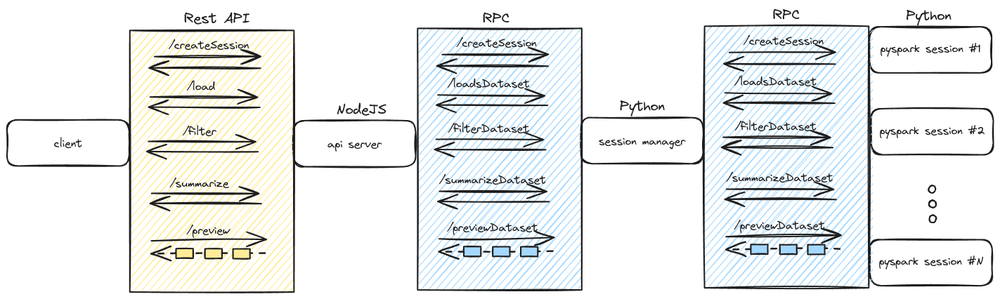

1. what is rpc

   - rpc vs rest (streaming is better with rpc)

2. Architecture
   

3. session manager

   - purpose: manage session in parallel way, handle multiple spark context to allow more dataset operations
   - spark sessions
   - new process as session

4. pyspark sesssion instance

   - purpose: perform concrete spark operation on dataset
   - actions vs transformations

5. api server

   - purpose: handle client requests
   - streaming
   - errors

6. test

   - multiple sessions dataset load test
   - custom error message
   - transforms chain vs action chain
